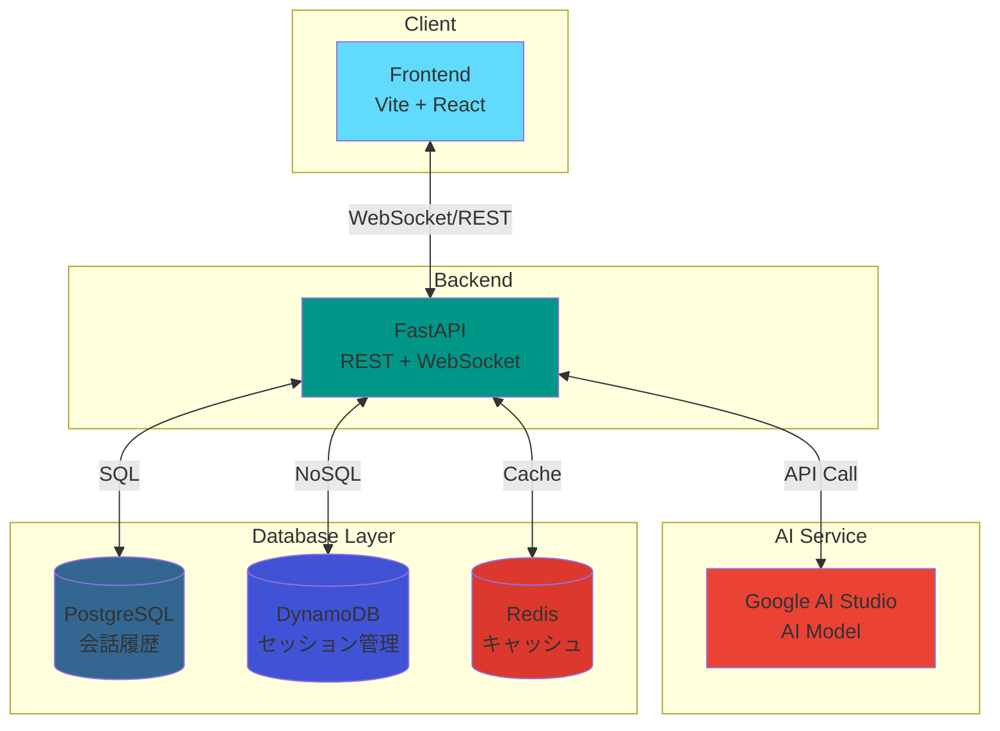

# アーキテクチャ

## 全体構成

```mermaid
graph TB
    subgraph "Client"
        Frontend[Frontend<br/>Vite + React]
    end
    
    subgraph "Backend"
        API[FastAPI<br/>REST + WebSocket]
    end
    
    subgraph "AI Service"
        AI[Google AI Studio<br/>AI Model]
    end
    
    subgraph "Database Layer"
        PostgreSQL[(PostgreSQL<br/>会話履歴)]
        DynamoDB[(DynamoDB<br/>セッション管理)]
        Redis[(Redis<br/>キャッシュ)]
    end
    
    Frontend <-->|WebSocket/REST| API
    API <-->|API Call| AI
    API <-->|SQL| PostgreSQL
    API <-->|NoSQL| DynamoDB
    API <-->|Cache| Redis
    
    style Frontend fill:#61dafb
    style API fill:#009688
    style AI fill:#ea4335
    style PostgreSQL fill:#336791
    style DynamoDB fill:#4053d6
    style Redis fill:#dc382d
```
