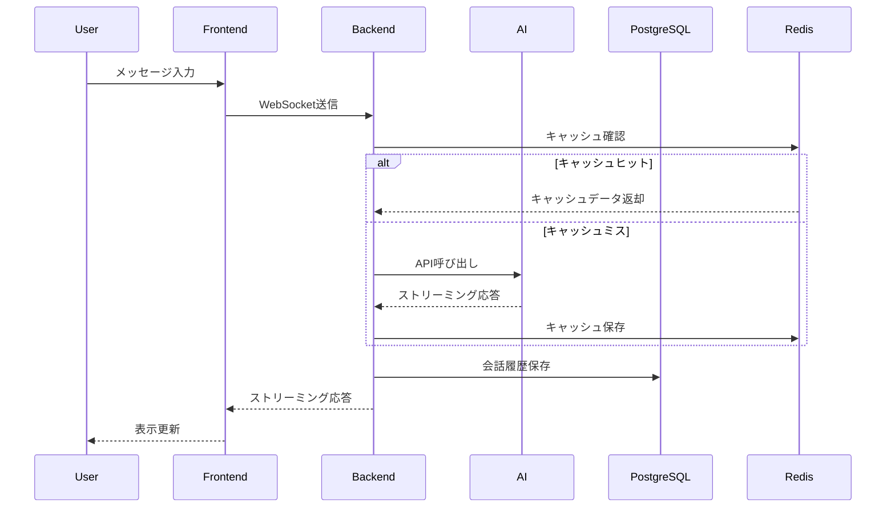

# データフロー

## チャット送信フロー

```mermaid
sequenceDiagram
    participant User
    participant Frontend
    participant Backend
    participant AI
    participant PostgreSQL
    participant Redis
    
    User->>Frontend: メッセージ入力
    Frontend->>Backend: WebSocket送信
    Backend->>Redis: キャッシュ確認
    alt キャッシュヒット
        Redis-->>Backend: キャッシュデータ返却
    else キャッシュミス
        Backend->>AI: API呼び出し
        AI-->>Backend: ストリーミング応答
        Backend->>Redis: キャッシュ保存
    end
    Backend->>PostgreSQL: 会話履歴保存
    Backend-->>Frontend: ストリーミング応答
    Frontend-->>User: 表示更新
```
