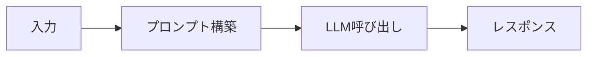
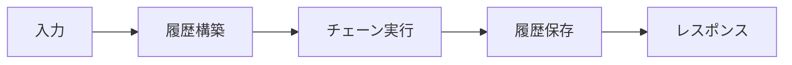
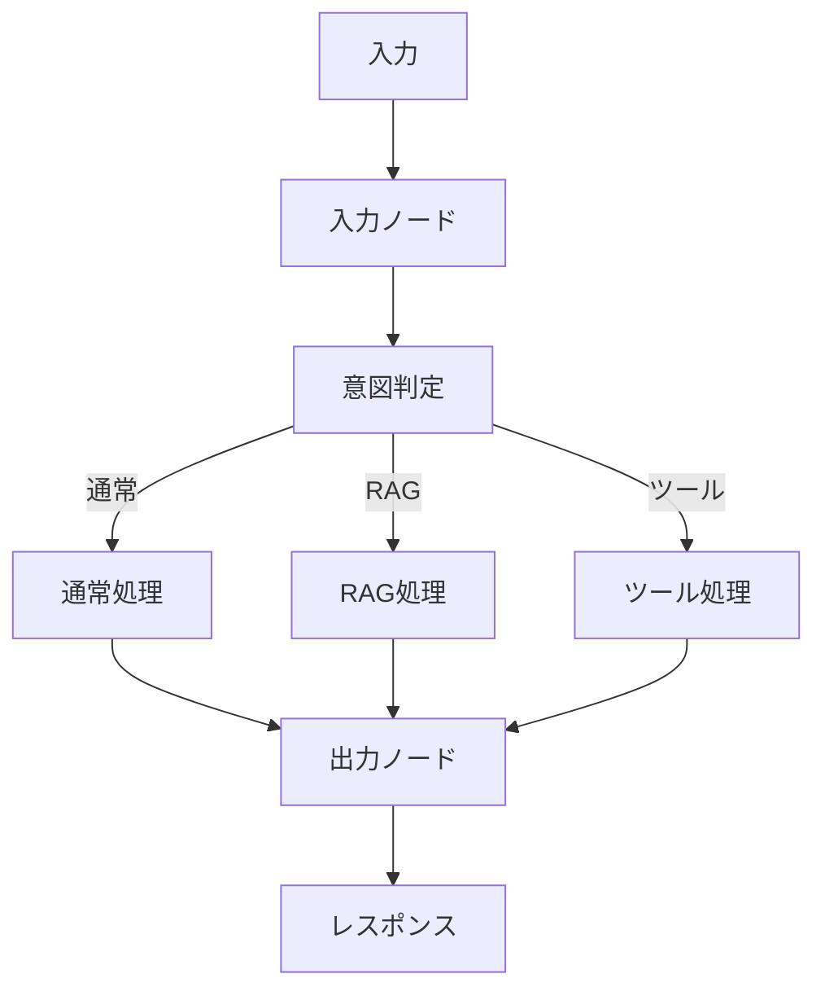

# AIサービス比較ドキュメント

## 概要

- 本プロジェクトでは、3つの異なるAIサービス実装を提供
- それぞれ異なるアプローチと機能を持ち、用途に応じて使い分けることが可能

## サービス一覧

1. **GoogleAIService** (`ai_service.py`)
   - シンプルな実装
   - LangChainの最小限の機能のみ使用

2. **LangChainAIService** (`langchain_ai_service.py`)
   - LangChainの機能を活用
   - プロンプトテンプレートとチェーンを使用

3. **LangGraphAIService** (`langgraph_ai_service.py`)
   - LangGraphを使用した複雑なフロー制御
   - 意図判定と条件分岐をサポート

## 詳細比較

### プロンプト構築

**GoogleAIService**:

- **方法**: 文字列連結
- **システムプロンプト**: なし
- **実装例**:

```python
def _build_prompt(self, message: Message, context: str = "") -> str:
    if context:
        return f"{context}\n\nUser: {message.content}\nAI:"
    return f"User: {message.content}\nAI:"
```

**LangChainAIService**:

- **方法**: `ChatPromptTemplate`を使用
- **システムプロンプト**: 設定ファイルから取得
- **実装例**:

```python
self._prompt = ChatPromptTemplate.from_messages([
    ("system", settings.LANGCHAIN_SYSTEM_PROMPT),
    MessagesPlaceholder(variable_name="history"),
    ("human", "{input}"),
])
```

**LangGraphAIService**:

- **方法**: `ChatPromptTemplate`を使用（LangChainAIServiceと同様）
- **システムプロンプト**: 設定ファイルから取得
- **実装例**:

```python
self._prompt = ChatPromptTemplate.from_messages([
    ("system", settings.LANGCHAIN_SYSTEM_PROMPT),
    MessagesPlaceholder(variable_name="messages"),
])
```

### 会話履歴管理

**GoogleAIService**:

- **方法**: 文字列としてプロンプトに埋め込み
- **形式**: `"User: ...\nAI: ...\nUser: ...\nAI: ..."`
- **特徴**:
  - シンプルな実装
  - 構造化されていない
  - メモリ管理なし

**LangChainAIService**:

- **方法**: `ChatMessageHistory`を使用
- **形式**: 構造化されたメッセージオブジェクト
- **特徴**:
  - コンテキスト文字列を解析してメッセージ履歴に変換
  - 会話後に履歴を保存
  - メモリ管理機能あり

**LangGraphAIService**:

- **方法**: ステート内の`messages`リストで管理
- **形式**: `BaseMessage`オブジェクトのリスト
- **特徴**:
  - グラフのステートとして管理
  - `add_messages`で自動的にメッセージを追加
  - 各ノード間でステートを共有

### 実行フロー

**GoogleAIService**:



- シンプルな線形フロー
- 条件分岐なし

**LangChainAIService**:



- チェーンベースの実行
- プロンプトテンプレートによる構造化

**LangGraphAIService**:



- グラフベースの実行
- 条件分岐とルーティング
- 複数のノードを経由

### 設定の柔軟性

**GoogleAIService**:

- **Temperature**: ハードコード（0.7）
- **システムプロンプト**: なし
- **設定項目**: 最小限

**LangChainAIService**:

- **Temperature**: 設定ファイルから取得（`LANGCHAIN_TEMPERATURE`）
- **システムプロンプト**: 設定ファイルから取得（`LANGCHAIN_SYSTEM_PROMPT`）
- **メモリタイプ**: 設定可能（`LANGCHAIN_MEMORY_TYPE`）
- **最大トークン数**: 設定可能（`LANGCHAIN_MAX_TOKENS`）

**LangGraphAIService**:

- **Temperature**: 設定ファイルから取得（`LANGCHAIN_TEMPERATURE`）
- **システムプロンプト**: 設定ファイルから取得（`LANGCHAIN_SYSTEM_PROMPT`）
- **デバッグモード**: 設定可能（`LANGGRAPH_DEBUG`）
- **有効/無効**: 設定可能（`LANGGRAPH_ENABLED`）

### メモリ管理

| 項目             | GoogleAIService | LangChainAIService   | LangGraphAIService     |
| ---------------- | --------------- | -------------------- | ---------------------- |
| **メモリ管理**   | なし            | あり（会話後に保存） | あり（ステートで管理） |
| **履歴の永続化** | なし            | なし（メモリ内のみ） | なし（メモリ内のみ）   |
| **履歴の構造化** | なし            | あり                 | あり                   |

### ストリーミング処理

**GoogleAIService**:

```python
async for chunk in self._llm.astream(messages):
    if chunk.content:
        yield chunk.content
```

- シンプルなストリーミング

**LangChainAIService**:

```python
async for chunk in chain.astream({"input": message.content, "history": messages}):
    if hasattr(chunk, "content") and chunk.content:
        content = chunk.content
        full_response += content
        yield content
```

- チェーン経由のストリーミング
- 完全なレスポンスを保存

**LangGraphAIService**:

```python
async for chunk in self._graph.astream(state):
    for node_name, node_output in chunk.items():
        if node_name == "normal_chat" or node_name == "rag_chat":
            # ノードごとの出力を処理
            ...
```

- グラフの各ノードからのストリーミング
- ノードごとの処理が必要

### 使用ケース

**GoogleAIService**:

- **適しているケース**:
  - シンプルな会話ボット
  - プロトタイプ開発
  - 最小限の依存関係で動作させたい場合
- **制限事項**:
  - システムプロンプトなし
  - 設定の柔軟性が低い
  - メモリ管理なし

**LangChainAIService**:

- **適しているケース**:
  - 標準的な会話ボット
  - システムプロンプトが必要
  - 会話履歴の構造化管理が必要
  - LangChainの機能を活用したい場合
- **制限事項**:
  - 条件分岐なし
  - 複雑なフロー制御が難しい

**LangGraphAIService**:

- **適しているケース**:
  - 複雑な会話フローが必要
  - 意図判定とルーティングが必要
  - RAGやツール実行などの拡張機能を将来追加予定
  - ステートマシンによる制御が必要
- **制限事項**:
  - 実装が複雑
  - パフォーマンスオーバーヘッドがある可能性

## 実装の詳細比較

### プロンプト構築の違い

**GoogleAIService**:

```python
# 文字列連結による構築
prompt = f"{context}\n\nUser: {message.content}\nAI:"
messages = [HumanMessage(content=prompt)]
```

**LangChainAIService**:

```python
# テンプレートによる構築
chain = self._prompt | self._llm
response = await chain.ainvoke({
    "input": message.content,
    "history": messages
})
```

**LangGraphAIService**:

```python
# テンプレートによる構築（ノード内で実行）
chain = self._prompt | self._llm
response = await chain.ainvoke({"messages": state["messages"]})
```

### 会話履歴の扱い

**GoogleAIService**:

- 文字列として扱う
- プロンプトに直接埋め込む
- 構造化されていない

**LangChainAIService**:

- `ChatMessageHistory`オブジェクトとして扱う
- コンテキスト文字列から解析して構築
- 会話後に履歴を更新

**LangGraphAIService**:

- ステート内の`messages`リストとして扱う
- `BaseMessage`オブジェクトのリスト
- ノード間で共有される

### 実行の流れ

**GoogleAIService**:

1. プロンプトを文字列で構築
2. `HumanMessage`を作成
3. LLMを直接呼び出し
4. レスポンスを返す

**LangChainAIService**:

1. コンテキストから履歴を構築
2. チェーンを作成（プロンプト | LLM）
3. チェーンを実行
4. 履歴を更新
5. レスポンスを返す

**LangGraphAIService**:

1. ステートを初期化
2. コンテキストからメッセージを構築
3. グラフを実行（複数ノードを経由）
   - 入力ノード
   - 意図判定ノード
   - ルーティング（通常/RAG/ツール）
   - 出力ノード
4. レスポンスを返す

## パフォーマンス比較

| 項目                 | GoogleAIService | LangChainAIService | LangGraphAIService       |
| -------------------- | --------------- | ------------------ | ------------------------ |
| **初期化時間**       | 最短            | 中程度             | 最長（グラフ構築）       |
| **実行速度**         | 最速            | 中程度             | やや遅い（ノード処理）   |
| **メモリ使用量**     | 最小            | 中程度             | やや多い（ステート管理） |
| **スケーラビリティ** | 低              | 中                 | 高                       |

## 選択ガイド

### GoogleAIServiceを選ぶ場合

- ✅ シンプルな実装で十分
- ✅ プロトタイプやテスト用途
- ✅ 最小限の依存関係
- ✅ システムプロンプトが不要

### LangChainAIServiceを選ぶ場合

- ✅ 標準的な会話ボット
- ✅ システムプロンプトが必要
- ✅ 会話履歴の構造化管理が必要
- ✅ LangChainの機能を活用したい
- ✅ 設定の柔軟性が必要

### LangGraphAIServiceを選ぶ場合

- ✅ 複雑な会話フローが必要
- ✅ 意図判定とルーティングが必要
- ✅ RAGやツール実行などの拡張機能を将来追加予定
- ✅ ステートマシンによる制御が必要
- ✅ 複数の処理パスを管理したい

## コード例

### 基本的な使用例

**GoogleAIService**:

```python
from app.infrastructure.services.ai_service import GoogleAIService
from app.domain.value_objects.message import Message

service = GoogleAIService()
message = Message(
    content="こんにちは",
    timestamp=datetime.now(),
    sender="user"
)

response = await service.generate_response(message, context="")
```

**LangChainAIService**:

```python
from app.infrastructure.services.langchain_ai_service import LangChainAIService
from app.domain.value_objects.message import Message

service = LangChainAIService()
message = Message(
    content="こんにちは",
    timestamp=datetime.now(),
    sender="user"
)

response = await service.generate_response(message, context="")
```

**LangGraphAIService**:

```python
from app.infrastructure.services.langgraph_ai_service import LangGraphAIService
from app.domain.value_objects.message import Message

service = LangGraphAIService()
message = Message(
    content="こんにちは",
    timestamp=datetime.now(),
    sender="user",
    metadata={"session_id": "session_123"}
)

response = await service.generate_response(message, context="")
```

### ストリーミング例

**GoogleAIService**:

```python
async for chunk in service.generate_stream(message, context=""):
    print(chunk, end="")
```

**LangChainAIService**:

```python
async for chunk in service.generate_stream(message, context=""):
    print(chunk, end="")
```

**LangGraphAIService**:

```python
async for chunk in service.generate_stream(message, context=""):
    print(chunk, end="")
```

## まとめ

3つのサービスはそれぞれ異なる用途に適しています：

- **GoogleAIService**: シンプルで軽量、プロトタイプ向け
- **LangChainAIService**: 標準的な会話ボット、LangChain機能活用
- **LangGraphAIService**: 複雑なフロー制御、拡張性重視

プロジェクトの要件に応じて適切なサービスを選択してください。
