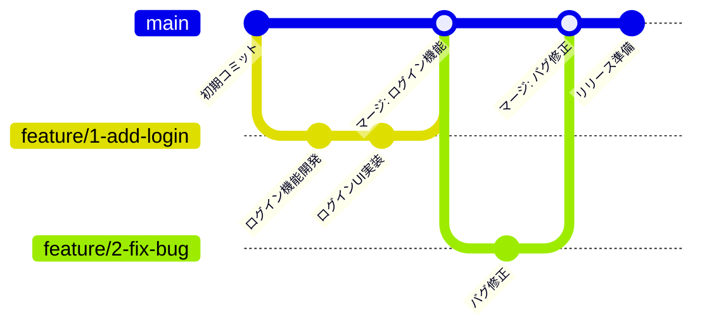

# ブランチ戦略

## GitHub Flow

本プロジェクトでは **GitHub Flow** を採用しています。
シンプルで効率的なブランチ戦略により、迅速な機能開発とデプロイを実現します。

### GitHub Flowの基本原則

- `main` ブランチは常にデプロイ可能な状態を保つ
- 新機能やバグ修正は `main` から分岐
- 作業完了後、プルリクエストでマージ前にレビュー
- レビュー承認後、`main` にマージして即座にデプロイ



### ワークフロー

1. **ブランチ作成**

   ```bash
   git checkout main
   git pull origin main
   git checkout -b feature/1-add-login
   ```

2. **開発とコミット**

   ```bash
   # 変更をコミット
   git add .
   git commit -m "feat: ログイン機能を追加"
   
   # 定期的にmainブランチの最新を取り込む
   git fetch origin
   git rebase origin/main
   ```

3. **プルリクエスト作成**
   - ブランチをリモートにプッシュ
   - GitHubでプルリクエストを作成
   - 関連するIssueをリンク

4. **レビューとマージ**
   - CodeRabbitによる自動レビュー
   - チームメンバーによるコードレビュー
   - すべてのチェックがパスしたらマージ

## ブランチ命名規則

ブランチ名は以下の形式に従います：

```text
<prefix>/<issue-id>-<short-description>
```

### Prefix 一覧

| Prefix | 用途 | 例 |
|--------|------|-----|
| `feature` | 新機能の実装 | `feature/1-add-user-authentication` |
| `fix` | バグ修正 | `fix/2-resolve-login-error` |
| `refactor` | リファクタリング | `refactor/3-optimize-database-query` |
| `docs` | ドキュメント更新 | `docs/4-update-api-documentation` |
| `style` | コードスタイル変更 | `style/5-format-code` |
| `test` | テスト追加・修正 | `test/6-add-unit-tests` |
| `chore` | ビルド設定や依存関係 | `chore/7-update-dependencies` |

### 命名例

```bash
# 新機能
feature/1-create-documentation

# バグ修正
fix/5-resolve-websocket-connection-issue

# リファクタリング
refactor/10-optimize-api-response-time
```

## コミットメッセージ

### Conventional Commits

コミットメッセージは **Conventional Commits** に従います。

```text
<type>(<scope>): <subject>

<body>

<footer>
```

### Type一覧

| Type | 説明 | 例 |
|------|------|-----|
| `feat` | 新機能の追加 | `feat(api): add user authentication` |
| `fix` | バグ修正 | `fix(websocket): resolve connection timeout` |
| `refactor` | リファクタリング | `refactor(db): optimize query performance` |
| `docs` | ドキュメント更新 | `docs: update API documentation` |
| `style` | コードスタイル変更 | `style: format code with black` |
| `test` | テスト追加・修正 | `test: add unit tests for chat router` |
| `chore` | ビルド設定や依存関係 | `chore: update dependencies` |
| `perf` | パフォーマンス改善 | `perf(api): improve response time` |

### コミットメッセージ例

```bash
# 新機能追加
feat(chat): add WebSocket connection management

# バグ修正
fix(db): resolve PostgreSQL connection pool issue

# リファクタリング
refactor(api): improve error handling with Pydantic

# ドキュメント更新
docs: update development setup guide

# 破壊的変更
feat(api)!: change authentication method from JWT to OAuth2
```

## プルリクエスト

### プルリクエストの要件

- **タイトル**: わかりやすく変更内容を表現
- **説明**: 変更理由、実装内容、関連Issueのリンク
- **テスト**: ローカル環境での動作確認済み
- **コードレビュー**: 最低1名の承認が必要
- **CI/CD**: すべてのチェックがパス

### ブランチの削除

マージ後は以下の手順でブランチを削除します。

```bash
# ローカルブランチの削除
git checkout main
git branch -d feature/1-add-login

# リモートブランチの削除
git push origin --delete feature/1-add-login
```

### タグ管理

リリース時はタグを付与します。

```bash
# タグの作成
git tag -a v1.0.0 -m "Release version 1.0.0"

# タグのプッシュ
git push origin v1.0.0
```

## 緊急時のホットフィックス

本番環境で重大なバグが発見された場合：

1. `main` ブランチから `hotfix/` ブランチを作成
2. 修正を実施
3. 迅速にレビューとマージ
4. 即座にデプロイ

```bash
git checkout main
git checkout -b hotfix/1-critical-security-fix
# 修正
git commit -m "fix: critical security vulnerability"
# プルリクエスト作成とマージ
```
