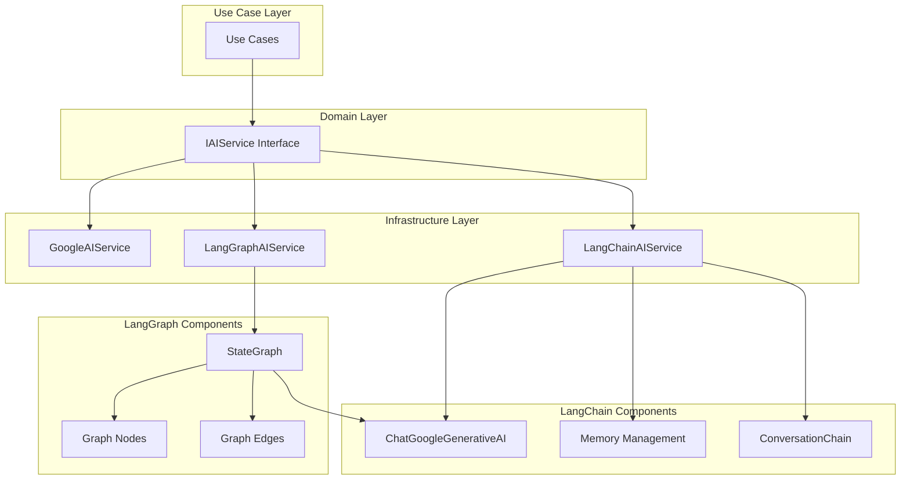

# LangChain / LangGraph

## 概要

本プロジェクトでは、LangChainとLangGraphを使用してAIチャットボットの機能を拡張しています。

- **LangChain**: LLMアプリケーション構築のためのフレームワーク
- **LangGraph**: LangChainの拡張機能であり、複雑な会話フローを制御するためのステートマシンベースのフレームワーク

> **📚 関連ドキュメント**: 3つのAIサービス（GoogleAIService、LangChainAIService、LangGraphAIService）の詳細な比較については、[AIサービス比較ドキュメント](./ai-services-comparison.md)を参照してください。

## 導入の目的

1. **会話履歴管理の改善**: 構造化されたメモリ管理とトークン制御
2. **ベクトル検索（RAG）**: 要件に含まれる意味検索機能の実装
3. **複雑な会話フローの実装**: 条件分岐、ループ、並列処理のサポート
4. **ツール・エージェント機能**: 将来的な機能拡張の基盤
5. **マルチモデル対応**: 複数のLLMプロバイダーへの対応

## アーキテクチャ

### 現在の実装



### ディレクトリ構造

```
backend/app/infrastructure/services/
├── ai_service.py              # GoogleAIService（既存）
├── langchain_ai_service.py    # LangChainAIService
└── langgraph_ai_service.py    # LangGraphAIService（新規）
```

## LangChain 実装

### LangChainAIService

既存の`LangChainAIService`を改善し、以下の機能を追加します：

#### 1. メモリ管理の改善

**現在の実装:**

- `ConversationBufferMemory`を使用
- 文字列形式のコンテキストから手動でメモリを構築

**改善点:**

- `ConversationSummaryMemory`: 長い会話を自動要約
- `ConversationSummaryBufferMemory`: 要約と最新の会話を組み合わせ
- トークン数の自動制御

#### 2. プロンプトテンプレート

```python
from langchain.prompts import ChatPromptTemplate, MessagesPlaceholder

prompt = ChatPromptTemplate.from_messages([
    ("system", "あなたは親切なアシスタントです。"),
    MessagesPlaceholder(variable_name="history"),
    ("human", "{input}")
])
```

#### 3. チェーンのカスタマイズ

- カスタムチェーンの作成
- 複数のチェーンを組み合わせ
- 条件分岐の実装

### 使用例

```python
from app.infrastructure.services.langchain_ai_service import LangChainAIService
from app.domain.value_objects.message import Message

service = LangChainAIService()
message = Message(content="こんにちは", timestamp=datetime.now(), sender="user")

# 通常の応答生成
response = await service.generate_response(message, context="")

# ストリーミング応答
async for chunk in service.generate_stream(message, context=""):
    print(chunk, end="")
```

## LangGraph 実装

### LangGraphAIService

複雑な会話フローを制御するための新しいサービスを実装します。

#### 1. ステート定義

```python
from typing import TypedDict, Annotated
from langgraph.graph.message import add_messages

class GraphState(TypedDict):
    messages: Annotated[list, add_messages]
    session_id: str
    user_id: str
    context: str
    metadata: dict
```

#### 2. ノード定義

- **入力ノード**: ユーザーメッセージの受信と前処理
- **意図判定ノード**: ユーザーの意図を判定
- **通常会話ノード**: 標準的な会話処理
- **RAGノード**: ベクトル検索を使用した情報検索
- **ツール実行ノード**: 外部ツールの実行
- **出力ノード**: レスポンスの生成と送信

#### 3. エッジ定義

- 条件分岐: ユーザーの意図に応じた処理分岐
- ループ: 情報収集が完了するまで繰り返し
- 並列処理: 複数の情報源から同時に情報取得

### 使用例

```python
from app.infrastructure.services.langgraph_ai_service import LangGraphAIService

service = LangGraphAIService()
message = Message(content="東京の天気は？", timestamp=datetime.now(), sender="user")

# グラフベースの応答生成
response = await service.generate_response(
    message,
    context="",
    session_id="session_123",
    user_id="user_456"
)
```

## ベクトル検索（RAG）機能

### 実装計画

1. **ベクトルストアの選択**
   - PostgreSQL + pgvector（既存のPostgreSQLを活用）
   - または Pinecone、Weaviate などの外部サービス

2. **ドキュメントの埋め込み**
   - 会話履歴の埋め込み
   - 外部ドキュメントの埋め込み

3. **検索チェーンの実装**
   - クエリの埋め込み
   - 類似度検索
   - コンテキストの構築

### 実装例（将来）

```python
from langchain.vectorstores import PGVector
from langchain.embeddings import GoogleGenerativeAIEmbeddings

embeddings = GoogleGenerativeAIEmbeddings(model="models/embedding-001")
vectorstore = PGVector.from_documents(
    documents=documents,
    embedding=embeddings,
    connection_string=postgres_connection_string
)

retriever = vectorstore.as_retriever()
rag_chain = ConversationalRetrievalChain.from_llm(
    llm=llm,
    retriever=retriever,
    memory=memory
)
```

## 依存関係

### 必要なパッケージ

```toml
dependencies = [
    # LangChain コア
    "langchain>=0.1.0",
    "langchain-core>=0.1.0",
    "langchain-community>=0.0.20",

    # LangGraph
    "langgraph>=0.0.20",

    # Google AI 統合
    "langchain-google-genai>=0.0.6",

    # ベクトルストア（将来）
    # "pgvector>=0.2.0",  # PostgreSQL + pgvector
    # "langchain-postgres>=0.0.1",  # LangChain PostgreSQL統合
]
```

## 設定

### 環境変数

既存の設定に加えて、以下の設定を追加できます：

```python
# app/infrastructure/config.py

class Settings(BaseSettings):
    # 既存の設定...

    # LangChain設定
    LANGCHAIN_MEMORY_TYPE: str = "buffer"  # buffer, summary, summary_buffer
    LANGCHAIN_MAX_TOKENS: int = 4000
    LANGCHAIN_TEMPERATURE: float = 0.7

    # LangGraph設定
    LANGGRAPH_ENABLED: bool = True
    LANGGRAPH_DEBUG: bool = False

    # RAG設定（将来）
    # RAG_ENABLED: bool = False
    # RAG_VECTOR_STORE: str = "postgres"  # postgres, pinecone, weaviate
```

## 移行戦略

### フェーズ1: LangChainの改善（現在）

1. ✅ `LangChainAIService`の基本実装（既存）
2. ⏳ メモリ管理の改善
3. ⏳ プロンプトテンプレートの追加
4. ⏳ 依存関係の追加

### フェーズ2: LangGraphの実装

1. ⏳ `LangGraphAIService`の実装
2. ⏳ 基本的なグラフフローの作成
3. ⏳ 意図判定ノードの実装
4. ⏳ 条件分岐の実装

### フェーズ3: RAG機能の実装（将来）

1. ⏳ ベクトルストアのセットアップ
2. ⏳ 埋め込みモデルの統合
3. ⏳ 検索チェーンの実装
4. ⏳ 会話履歴のベクトル化

### フェーズ4: ツール・エージェント機能（将来）

1. ⏳ ツール定義
2. ⏳ エージェントの実装
3. ⏳ ツール実行チェーンの構築

## 動作確認

詳細な動作確認方法については、[動作確認ガイド](./langchain-testing.md)を参照してください。

### クイックスタート

```bash
# 単体テストスクリプトを実行
cd backend
uv run python test_langchain_service.py
```

### 単体テスト

```python
import pytest
from app.infrastructure.services.langchain_ai_service import LangChainAIService

@pytest.mark.asyncio
async def test_langchain_service():
    service = LangChainAIService()
    message = Message(content="テスト", timestamp=datetime.now(), sender="user")
    response = await service.generate_response(message, context="")
    assert response is not None
    assert len(response) > 0
```

### 統合テスト

```python
@pytest.mark.asyncio
async def test_langgraph_flow():
    service = LangGraphAIService()
    # グラフフローのテスト
    pass
```

## トラブルシューティング

### よくある問題

1. **メモリのトークン数超過**
   - `ConversationSummaryMemory`を使用して自動要約
   - トークン数の上限を設定

2. **ストリーミングが動作しない**
   - `astream`メソッドを使用しているか確認
   - 非同期ジェネレータの実装を確認

3. **グラフがループする**
   - 終了条件を確認
   - 最大反復回数を設定

## 参考資料

- [LangChain公式ドキュメント](https://python.langchain.com/)
- [LangGraph公式ドキュメント](https://langchain-ai.github.io/langgraph/)
- [LangChain Google AI統合](https://python.langchain.com/docs/integrations/llms/google_generative_ai)

## 更新履歴

- 2024-XX-XX: 初版作成
