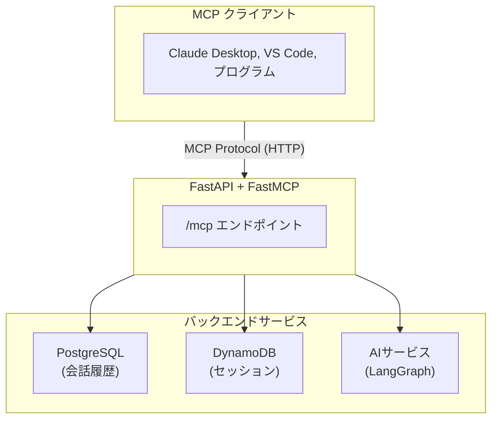

# MCP (Model Context Protocol) サーバー

## 概要

本プロジェクトでは[FastMCP](https://github.com/jlowin/fastmcp)を使用して、MCPサーバーを提供しています。これにより、Claude Desktop、VS Code、その他のMCPクライアントから、チャットボットの機能にアクセスできます。

## MCPとは

Model Context Protocol (MCP) は、LLM（Large Language Model）とデータ・機能を接続するための標準プロトコルです。MCPを使用することで、AIアシスタントが外部ツールやデータソースにアクセスできるようになります。

## 機能

### 提供するツール

| ツール名               | 説明                           |
| ---------------------- | ------------------------------ |
| `search_conversations` | 会話履歴をキーワードで検索     |
| `get_session_history`  | 特定セッションの会話履歴を取得 |
| `get_session_info`     | セッション情報を取得           |
| `list_sessions`        | ユーザーのセッション一覧を取得 |
| `chat`                 | AIとチャット（メッセージ送信） |

### 提供するリソース

| リソースURI       | 説明                     |
| ----------------- | ------------------------ |
| `chatbot://stats` | チャットボットの統計情報 |

### 提供するプロンプト

| プロンプト名                  | 説明                                     |
| ----------------------------- | ---------------------------------------- |
| `analyze_conversation_prompt` | 会話履歴を分析するためのテンプレート     |
| `search_and_summarize_prompt` | 会話を検索して要約するためのテンプレート |

## 接続方法

### エンドポイント

MCPサーバーは以下のエンドポイントで提供されています：

```text
http://localhost:8000/mcp
```

### Claude Desktop での設定

`claude_desktop_config.json` に以下を追加：

```json
{
  "mcpServers": {
    "ai-chatbot": {
      "command": "npx",
      "args": ["mcp-remote", "http://localhost:8000/mcp"]
    }
  }
}
```

または、直接HTTPで接続する場合：

```json
{
  "mcpServers": {
    "ai-chatbot": {
      "url": "http://localhost:8000/mcp"
    }
  }
}
```

### VS Code (Cursor) での設定

`.cursor/mcp.json` または VS Codeの設定に追加：

```json
{
  "mcpServers": {
    "ai-chatbot": {
      "url": "http://localhost:8000/mcp"
    }
  }
}
```

## 使用例

### Claude Desktopでの使用

1. Claude Desktopを開き、MCPサーバーに接続
2. 以下のような質問をすると、MCPツールが呼び出されます：

```text
過去の会話で「Python」について話した内容を検索してください
```

```text
セッションID "abc123" の会話履歴を見せてください
```

```text
「こんにちは」とAIにメッセージを送ってください
```

### プログラムからの接続

FastMCP Clientを使用してプログラムから接続することもできます：

```python
from fastmcp import Client

async def main():
    async with Client("http://localhost:8000/mcp") as client:
        # 会話を検索
        results = await client.call_tool(
            "search_conversations",
            {"query": "Python", "limit": 5}
        )
        print(results)

        # チャット
        response = await client.call_tool(
            "chat",
            {"message": "こんにちは！", "user_id": "test-user"}
        )
        print(response)
```

## アーキテクチャ



## 開発

### MCPサーバーの起動確認

```bash
# Dockerでアプリケーションを起動
make up

# MCPエンドポイントにアクセス
curl http://localhost:8000/mcp
```

### 新しいツールの追加

`backend/app/mcp/server.py` にツールを追加：

```python
@mcp.tool
async def my_new_tool(
    param: str = Field(description="パラメータの説明"),
    ctx: Context | None = None,
) -> dict[str, Any]:
    """ツールの説明"""
    if ctx:
        await ctx.info("処理中...")

    # 処理を実装
    return {"result": "success"}
```

## 設定

| 環境変数      | 説明                | デフォルト |
| ------------- | ------------------- | ---------- |
| `MCP_ENABLED` | MCPサーバーを有効化 | `True`     |

## トラブルシューティング

### 接続できない場合

1. アプリケーションが起動していることを確認
2. `/mcp` エンドポイントにアクセスできることを確認
3. CORSの設定を確認

### ツールがエラーを返す場合

1. ログを確認（`docker compose logs backend`）
2. データベース接続を確認
3. 必要な環境変数が設定されていることを確認

## 参考リンク

- [FastMCP公式ドキュメント](https://gofastmcp.com/)
- [MCP仕様](https://modelcontextprotocol.io/)
- [Claude Desktop MCP設定](https://docs.anthropic.com/claude/docs/mcp)
